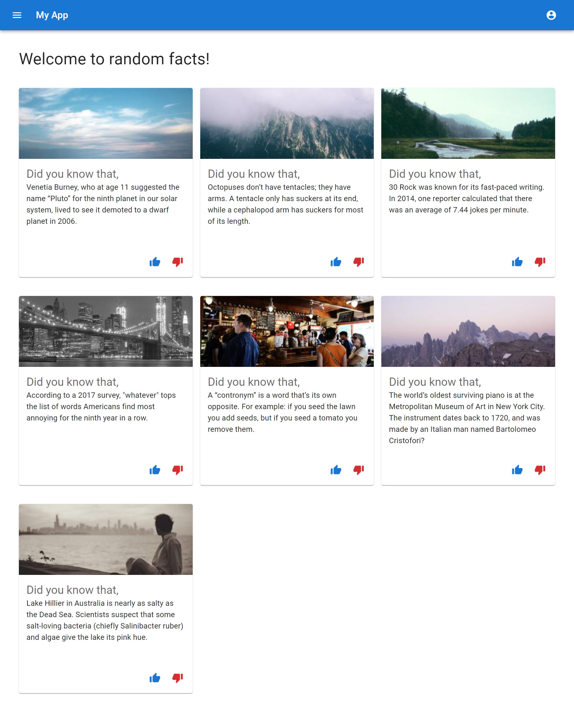

## Project Name

This is a little description about your project.

**Tech Stack:** MongoDB, Express.js, React.js, Node.js, Typescript

**Contributors**: [Hatchways](https://github.com/hatchways) (replace)

---

### Getting Started

1. Clone or download repository

---

## Server

1. Go into the server directory `cd server`
2. Run `npm install` to install packages
3. Create your environment variable (.env) file
4. Run `npm run dev` to start the server

---

## Client

1. Go into the client directory `cd client`
2. Run `npm install` to install packages
3. Run `npm start` to start the client side

---
### e2e Test
1. Go into the server directory `cd server`
2. Create a `.env` file in the `server/test` directory and copy the contents of the `server/sample.env` file here
3. Mongo should be running in your local environment
3. Run `npm run test` to start the e2e test.

### Demo

1. Registration. Users will be able to create a new account using their email and password

2. Dashboard. Here is a description about what a user can expect to see

